# MNIST GAN

A DCGAN (Deep Convolutional GAN) implementation in TensorFlow/Keras that generates handwritten digit images. Ported from a MATLAB implementation with matching architecture and hyperparameters.

## Architecture

```mermaid
graph LR
    subgraph Generator
        Z[Latent z<br/>100-dim] --> D1[Dense<br/>1008]
        D1 --> R[Reshape<br/>3×3×112]
        R --> TC1[TransConv<br/>5×5, 56<br/>valid]
        TC1 --> BN1[BN + ReLU]
        BN1 --> TC2[TransConv<br/>5×5, 28<br/>stride 2]
        TC2 --> BN2[BN + ReLU]
        BN2 --> TC3[TransConv<br/>5×5, 1<br/>stride 2]
        TC3 --> T[tanh]
        T --> IMG[Image<br/>28×28×1]
    end

    subgraph Discriminator
        I[Image<br/>28×28×1] --> DO[Dropout<br/>0.5]
        DO --> C1[Conv 5×5, 28<br/>stride 2]
        C1 --> LR1[LeakyReLU]
        LR1 --> C2[Conv 5×5, 56<br/>stride 2]
        C2 --> BN3[BN + LeakyReLU]
        BN3 --> C3[Conv 5×5, 112<br/>stride 2]
        C3 --> BN4[BN + LeakyReLU]
        BN4 --> C4[Conv 5×5, 224<br/>stride 2]
        C4 --> BN5[BN + LeakyReLU]
        BN5 --> C5[Conv 2×2, 1<br/>valid]
        C5 --> L[Logit]
    end
```



### Generator
| Layer | Output Shape | Description |
|-------|--------------|-------------|
| Input | (batch, 100) | Latent vector |
| Dense | (batch, 1008) | Project to 3×3×112 |
| Reshape | (batch, 3, 3, 112) | Spatial structure |
| TransConv2D | (batch, 7, 7, 56) | 5×5, valid padding |
| BatchNorm + ReLU | (batch, 7, 7, 56) | |
| TransConv2D | (batch, 14, 14, 28) | 5×5, stride 2 |
| BatchNorm + ReLU | (batch, 14, 14, 28) | |
| TransConv2D | (batch, 28, 28, 1) | 5×5, stride 2 |
| tanh | (batch, 28, 28, 1) | Output in [-1, 1] |

### Discriminator
| Layer | Output Shape | Description |
|-------|--------------|-------------|
| Input | (batch, 28, 28, 1) | Image |
| Dropout | (batch, 28, 28, 1) | p=0.5 |
| Conv2D | (batch, 14, 14, 28) | 5×5, stride 2 |
| LeakyReLU | (batch, 14, 14, 28) | α=0.2 |
| Conv2D | (batch, 7, 7, 56) | 5×5, stride 2 |
| BatchNorm + LeakyReLU | (batch, 7, 7, 56) | |
| Conv2D | (batch, 4, 4, 112) | 5×5, stride 2 |
| BatchNorm + LeakyReLU | (batch, 4, 4, 112) | |
| Conv2D | (batch, 2, 2, 224) | 5×5, stride 2 |
| BatchNorm + LeakyReLU | (batch, 2, 2, 224) | |
| Conv2D | (batch, 1, 1, 1) | 2×2, valid |
| Flatten | (batch, 1) | Logit output |

## Training Hyperparameters

Matched to the original MATLAB implementation:

| Parameter | Value |
|-----------|-------|
| Optimizer | Adam |
| Learning rate | 0.0002 |
| β₁ | 0.5 |
| β₂ | 0.999 |
| Batch size | 60 |
| Epochs | 500 |
| Label flip probability | 0.3 |
| Loss | Binary cross-entropy |

## Installation

### Basic Installation

```bash
pip install -r requirements.txt
```

### GPU Acceleration

TensorFlow automatically detects and uses available GPUs. Platform-specific setup:

**macOS (Apple Silicon M1/M2/M3):**
```bash
# Requires TensorFlow 2.18.x for Metal support
pip install tensorflow==2.18.0 tensorflow-metal==1.2.0
```

**Windows/Linux (NVIDIA CUDA):**
```bash
# Install CUDA toolkit and cuDNN, then:
pip install tensorflow[and-cuda]
```

The code auto-detects available devices at runtime:
```python
from src import print_device_info
print_device_info()
# Output: Platform, TensorFlow version, GPU availability
```

## Usage

### Quick Start

```python
from src import train_gan

# Train with default MATLAB-matched parameters
trainer = train_gan(epochs=50)

# Generate samples
samples = trainer.generate_samples(num_samples=25)
```

### Custom Training

```python
from src import GANTrainer

# Initialize trainer
trainer = GANTrainer(
    batch_size=60,
    epochs=100,
    learning_rate=0.0002,
    flip_factor=0.3
)

# Load data and build model
trainer.load_data()
trainer.build_model()

# Train with callbacks
callbacks = trainer.get_default_callbacks(sample_frequency=100)
history = trainer.train(callbacks=callbacks)
```

### Using the Model Directly

```python
from src import MNISTGAN
import tensorflow as tf

# Create and compile
gan = MNISTGAN(latent_dim=100, flip_factor=0.3)
gan.compile()

# Load MNIST and train
(train_images, _), _ = tf.keras.datasets.mnist.load_data()
train_images = (train_images.reshape(-1, 28, 28, 1) - 127.5) / 127.5
dataset = tf.data.Dataset.from_tensor_slices(train_images).batch(60)

gan.fit(dataset, epochs=50)

# Generate images
z = tf.random.normal((25, 100))
generated = gan.generator(z, training=False)
```

### Jupyter Notebook

For interactive training with visualizations:

```bash
jupyter notebook notebooks/training_demo.ipynb
```

## Project Structure

```
mnist/
├── src/
│   ├── __init__.py          # Package exports
│   ├── models/
│   │   ├── __init__.py
│   │   ├── base.py          # Abstract base network class
│   │   ├── generator.py     # Generator network
│   │   └── discriminator.py # Discriminator network
│   ├── gan.py               # MNISTGAN class with custom train_step
│   ├── trainer.py           # GANTrainer orchestration
│   ├── callbacks.py         # Sample generation callback
│   └── utils.py             # Image utilities
├── notebooks/
│   └── training_demo.ipynb  # Interactive training demo
├── outputs/
│   └── generated_samples/   # Generated images during training
├── requirements.txt
└── README.md
```

## Key Design Decisions

| Aspect | This Implementation |
|--------|---------------------|
| Projection size | 3×3×112 (matches MATLAB) |
| Filter sequence | 28, 56, 112, 224 |
| Input dropout | 0.5 on discriminator input |
| Label flipping | 30% of real labels |
| Loss | BCE with from_logits=True |

## Requirements

- Python 3.10 - 3.12
- TensorFlow 2.18.x (for Mac GPU) or TensorFlow >= 2.15.0 (CPU/CUDA)
- NumPy >= 1.24.0
- Matplotlib >= 3.7.0
- Jupyter >= 1.0.0

### Platform Compatibility

| Platform | GPU Support | TensorFlow Version |
|----------|-------------|-------------------|
| macOS (Apple Silicon) | Metal | 2.18.0 + tensorflow-metal 1.2.0 |
| macOS (Intel) | None | >= 2.15.0 |
| Windows | CUDA | >= 2.15.0 |
| Linux | CUDA | >= 2.15.0 |

## License

MIT
